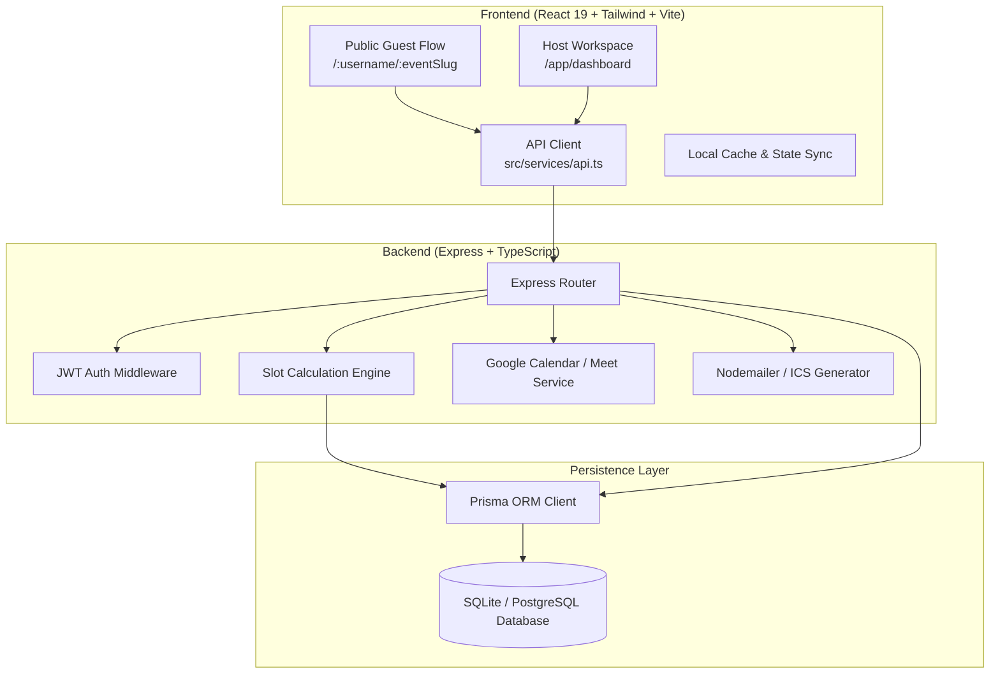
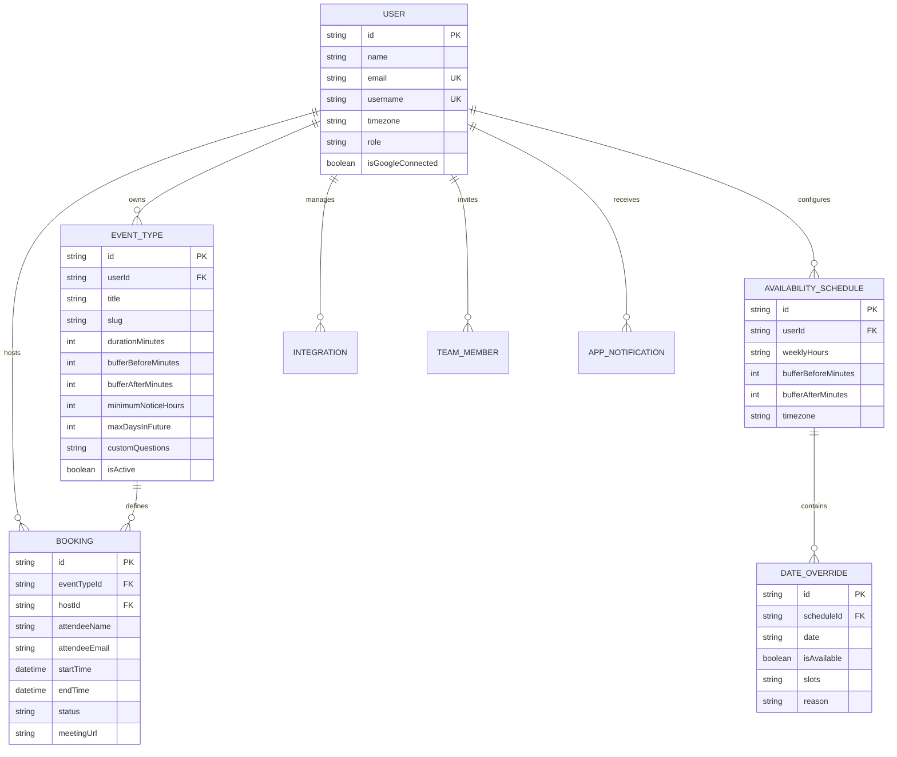

# 📅 Schedulr — Full Technical & System Documentation

**Schedulr** is a high-performance, modern scheduling platform designed to streamline 1-on-1 and team appointment scheduling with Google Calendar/Meet integration, real-time availability computation, timezone normalization, and race-condition-safe booking.

---

## 1. System Architecture



---

## 2. Technology Stack

### Frontend
- **Framework**: React 19 + TypeScript
- **Bundler & Tooling**: Vite 8
- **Styling**: Tailwind CSS 3 (Custom Bright Gold Theme & Dark/Light mode tokens)
- **Icons**: Lucide React
- **Date Handling**: `date-fns` v4
- **Routing**: `react-router-dom` v7
- **Special Effects**: `canvas-confetti`

### Backend
- **Runtime**: Node.js v22 (ES Modules)
- **Framework**: Express 4 with TypeScript 5
- **ORM & Database**: Prisma ORM 6 with SQLite (Local) / PostgreSQL (Production)
- **Authentication**: JSON Web Tokens (`jsonwebtoken`) + `bcryptjs`
- **Integrations**: `googleapis` (OAuth2, Google Calendar v3, Google Meet)
- **Email & Calendar**: `nodemailer` + Custom VCALENDAR `.ics` generator

---

## 3. Database Schema & Data Models



---

## 4. Core Algorithms & Business Logic

### 1. Available Slot Calculation (`serverSlotEngine`)
The slot calculation algorithm guarantees zero scheduling overlaps and enforces strict host availability rules:
1. **Time Horizon Boundaries**: Verifies target date is not in the past and does not exceed `maxDaysInFuture` (default 60 days).
2. **Minimum Notice Enforcement**: Rejects slots that fall within the `minimumNoticeHours` (e.g. 2 hours from current timestamp).
3. **Date Overrides Precedence**: Checks if a specific override exists for `YYYY-MM-DD`. If present, it overrides the standard weekly hours.
4. **Buffer Times**: Applies `bufferBeforeMinutes` and `bufferAfterMinutes` to expand occupied booking blocks.
5. **Collision Detection**: Filters out any slot `[slotStart, slotEnd]` where:
   $$\text{slotWithBufferStart} < \text{bookingEnd} \quad \land \quad \text{slotWithBufferEnd} > \text{bookingStart}$$

### 2. Double-Booking & Race Condition Prevention
To prevent two guests from claiming the same slot at the exact same moment:
- All booking creations execute inside an atomic database transaction (`prisma.$transaction`).
- The transaction acquires a lock, checks for any overlapping active booking, creates the new booking, and returns `HTTP 409 Conflict` if the slot was taken.

---

## 5. API Reference Catalog

### Public Endpoints (No Auth Required)
| Method | Endpoint | Description |
| :--- | :--- | :--- |
| `GET` | `/api/public/:username` | Retrieve host public bio and active event types. |
| `GET` | `/api/public/:username/:eventSlug` | Retrieve event details and host timezone. |
| `GET` | `/api/public/:username/:eventSlug/slots?date=YYYY-MM-DD` | Get calculated available time slots for a specific date. |
| `POST` | `/api/public/bookings` | Book a time slot, create Google Meet link, and dispatch email invites. |
| `GET` | `/api/public/bookings/:id` | Retrieve booking details for public reschedule/cancel pages. |
| `POST` | `/api/public/bookings/:id/reschedule` | Reschedule booking to a new time. |
| `POST` | `/api/public/bookings/:id/cancel` | Cancel booking with optional reason. |

### Host Endpoints (Protected with `Authorization: Bearer <token>`)
| Method | Endpoint | Description |
| :--- | :--- | :--- |
| `POST` | `/api/auth/login` | Authenticate host via email/password. |
| `POST` | `/api/auth/register` | Register new host account. |
| `GET` | `/api/auth/me` | Fetch authenticated host profile. |
| `PUT` | `/api/auth/me` | Update host name, bio, username, timezone. |
| `GET` | `/api/events` | List all host event types. |
| `POST` | `/api/events` | Create a new event type. |
| `PUT` | `/api/events/:id` | Update an existing event type. |
| `PATCH`| `/api/events/:id/toggle` | Toggle active/inactive status of an event type. |
| `DELETE`| `/api/events/:id` | Delete event type. |
| `GET` | `/api/availability` | Get weekly hours and overrides. |
| `PUT` | `/api/availability/weekly` | Update weekly working hours schedule. |
| `PUT` | `/api/availability/buffers` | Update default buffer times. |
| `POST` | `/api/availability/overrides` | Add or update a specific date override. |
| `DELETE`| `/api/availability/overrides/:id` | Delete date override. |
| `GET` | `/api/bookings` | List host bookings (all/upcoming/past/cancelled). |
| `GET` | `/api/bookings/analytics` | Get booking metrics, total meeting hours, completion rate. |
| `GET` | `/api/team` | List team members. |
| `POST` | `/api/team` | Invite new team member. |
| `GET` | `/api/notifications` | Get in-app notifications. |
| `PATCH`| `/api/notifications/read-all` | Mark all notifications read. |

---

## 6. Directory Structure

```text
schedulr/
├── backend/
│   ├── prisma/
│   │   ├── schema.prisma        # Database schema definitions
│   │   ├── seed.ts              # Demo seed data script
│   │   └── dev.db               # SQLite database
│   ├── src/
│   │   ├── middleware/
│   │   │   └── auth.ts          # JWT authentication middleware
│   │   ├── routes/
│   │   │   ├── auth.routes.ts
│   │   │   ├── events.routes.ts
│   │   │   ├── availability.routes.ts
│   │   │   ├── bookings.routes.ts
│   │   │   ├── public.routes.ts
│   │   │   ├── team.routes.ts
│   │   │   ├── integrations.routes.ts
│   │   │   └── notifications.routes.ts
│   │   ├── services/
│   │   │   ├── slotEngine.ts    # Server-side slot calculation
│   │   │   ├── googleCalendar.ts# Google Calendar & Meet integration
│   │   │   └── emailService.ts  # Nodemailer & ICS generator
│   │   ├── app.ts               # Express configuration & middleware
│   │   ├── prisma.ts            # Prisma client singleton
│   │   └── server.ts            # Server entry point (:5001)
│   ├── .env                     # Environment configurations
│   ├── package.json
│   └── tsconfig.json
│
└── frontend/
    ├── src/
    │   ├── components/          # UI components (booking, calendar, modals)
    │   ├── context/             # AuthContext, ThemeContext, ToastContext
    │   ├── pages/
    │   │   ├── app/             # Host dashboard, events, bookings, analytics
    │   │   ├── auth/            # Host login
    │   │   └── public/          # Public booking, reschedule, cancel, profile
    │   ├── services/
    │   │   ├── api.ts           # Central HTTP client
    │   │   ├── bookingService.ts
    │   │   ├── eventService.ts
    │   │   ├── availabilityService.ts
    │   │   ├── userService.ts
    │   │   ├── teamService.ts
    │   │   └── notificationService.ts
    │   ├── types/               # TypeScript interfaces
    │   ├── App.tsx              # App router
    │   └── main.tsx
    ├── package.json
    └── tailwind.config.js
```

---

## 7. Environment Configuration

### Backend (`backend/.env`)
```env
PORT=5001
DATABASE_URL="file:./dev.db"
JWT_SECRET="schedulr_super_secret_jwt_key_2026_dev_prod"
FRONTEND_URL="http://localhost:5173"

# Optional Google OAuth Credentials
GOOGLE_CLIENT_ID=""
GOOGLE_CLIENT_SECRET=""
GOOGLE_REDIRECT_URI="http://localhost:5001/api/auth/google/callback"

# Optional SMTP Email Dispatch
SMTP_HOST=""
SMTP_PORT="587"
SMTP_USER=""
SMTP_PASS=""
EMAIL_FROM="Schedulr <notifications@schedulr.app>"
```

### Frontend (`frontend/.env`)
```env
VITE_API_URL="http://localhost:5001/api"
```

---

## 8. Development & Deployment

### Run Locally
```bash
# 1. Start Backend Server
cd backend
npm run dev
# Server running at http://localhost:5001

# 2. Start Frontend App (in a separate terminal)
cd frontend
npm run dev
# Client running at http://localhost:5173
```

### Production Build
```bash
# Build Backend
cd backend && npm run build

# Build Frontend
cd frontend && npm run build
```
